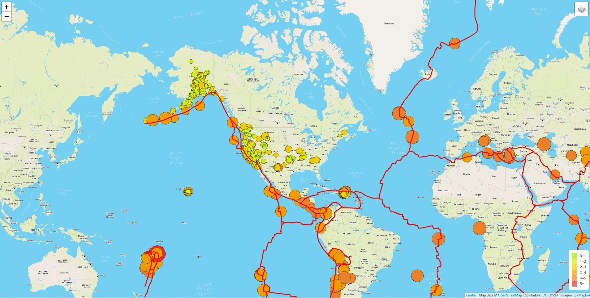
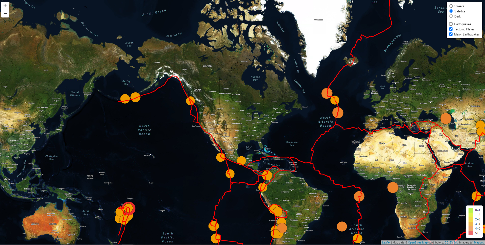
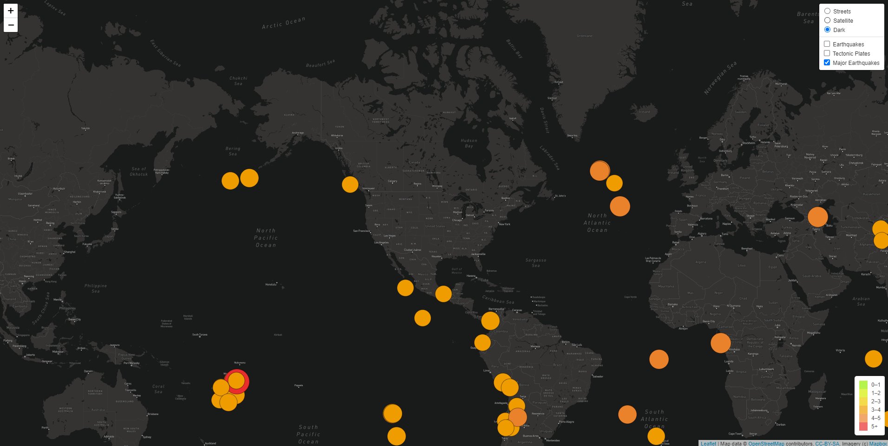

# Mapping Earthquakes

---

## Overview:

The purpose of this challenge was to retrieve data on earthquakes across the globe and plot it on a map using Javascript, d3json, GeoJSON and Leaflet.js. The resulting html provides a clear view of the earth with multiple filtering options - Street, Satellite, and Dark Map, along with a legend providing information on the relative size of the earthquakes. Each of the circle markers provide information on the location and magnitude of the earthquake and the size of the circles reflects the magnitude.

### Street Map - All Earquakes & Tectonic Plates

### Satellite Map - Tectonic Plates & Major Earthquakes

### Dark Map - Major Earthquakes

